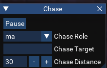
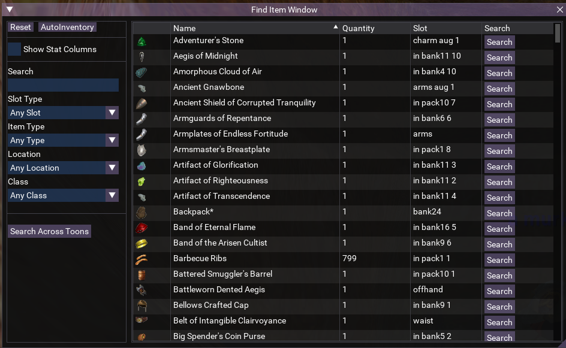
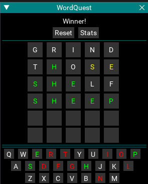

# Lua Scripts for MQ

The home for all info on Lua scripts which I maintain at [RedGuides](https://redguides.com){target=_blank}.

## BoxHUD

A HUD which uses DanNet to display box information.

## MAUI

An INI Editor for the MuleAssist macro.

## Event Manager

A weakauras-like take on MQ2Events and MQ2React.

## Chase

Standalone MQ2Nav based chase utility similar to CWTN chase mode.

## AQOBot

An assist bot which behaves similar to CWTN plugins for a few classes.

## Loot N Scoot

A port of the RedGuides version of `NinjAdvLoot.inc` for loot automation on EMU servers.

## Find Item Window

This lua script recreates the find item window from live EQ for EMU servers where it does not exist.  

## WordQuest

A game to play while playing other games.

## Misc Luas

A home for misc. Lua scripts that don't have anywhere else to go.

## LuaBard

A Bard assist bot.

## LuaNecro

A Necromancer assist bot.

