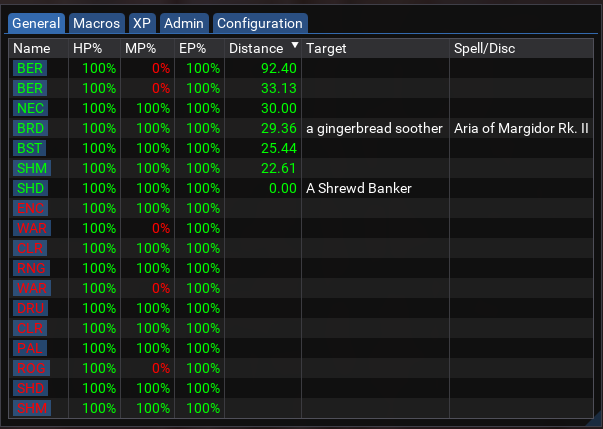

# BoxHUD

[View Repo](https://gitlab.com/aquietone/boxhud)
[View on RedGuides](https://www.redguides.com/community/resources/boxhud.2088/)
[Download](https://gitlab.com/aquietone/boxhud/-/archive/v2.5.2/boxhud-v2.5.2.zip)

A HUD which uses DanNet to display box information.

