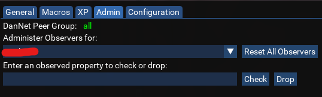

# Troubleshooting

 The Admin tab of Boxhud contains some options to help resolve issues that may occur with DanNet observers. 
 
 If characters go LD or you swap characters, or for some other reason your DanNet observed properties get screwed up, you can try to reset them from the Admin tab.

 
