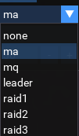

# Chase

[View Repo](https://gitlab.com/aquietone/luachase){target=_blank}  
[View on RedGuides](https://www.redguides.com/community/resources/chase.2392/){target=_blank}  
[Download](https://gitlab.com/aquietone/luachase/-/archive/main/luachase-main.zip)  

Standalone MQ2Nav based chase utility similar to CWTN chase mode.




## Overview

Chases the specified player using MQ2Nav, because who likes that pesky afollow. Not much else to it. It will chase if the chase distance is exceeded and you are not currently:  

- Casting (unless you're a bard)  
- Auto attack on  
- AutoFire on  
- Hovering (dead)  
- Sticking to something  
- Already nav'ing somewhere  

Intended for use when running something without an available chase mode, or characters outside of group or some other situation where your only option is typically afollow. Don't try to run this at the same time as something else which does chasing.  

## Installation

### Manual Install

1. Clone the repo or download the zip file linked above.  
2. Move `chase.lua` into the MQ `lua` folder.  

### RedGuides Launcher

1. Navigate to the Chase resource page and click the `Watch` button on the `Overview` tab.  
2. Open the RedGuides Launcher and install Chase from the `Lua` tab. 

## Commands

In addition to the UI shown above, command line options are available as well:  

- `/lua run chase [somedude]` -- Start the script, optionally providing the name of a PC to chase
- `/luachase pause on|1|true` -- pause chasing  
- `/luachase pause off|0|false` -- resume chasing  
- `/luachase role ma|mt|leader|raid1|raid2|raid3` -- chase the PC matching the specified role  
- `/luachase role` -- prints the current role PC to chase  
- `/luachase target` -- sets the chase to your current target, if it is a valid PC target  
- `/luachase name somedude` -- sets the chase target to somedude  
- `/luachase name` -- prints the current chase target  
- `/luachase distance 30` -- sets the chase distance to 30  
- `/luachase distance` -- prints the current chase distance  
- `/luachase show` -- displays the UI window  
- `/luachase hide` -- hides the UI window  
- `/luachase [help]` -- displays the help output  

## Notes

Chase Target is used when Chase Role is set to None. Otherwise, Chase Target is ignored.  

I picked some arbitrary upper/lower boundaries for the chase distance:  

```ini
Min distance == 15
Max distance == 300
```

The chase target uses `${Spawn[pc =%s]}` when role is set to `None`, so it will only chase an exact match PC name.