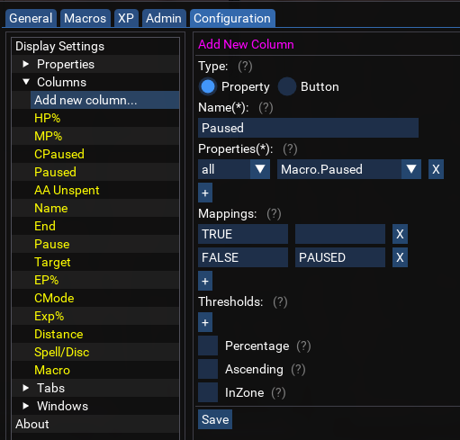

# Column Configuration

Columns define how a particular property should be displayed. One column may show different properties depending on class or archtype, or may display the same property for all rows in the column.
There are two types of columns:  

* `Property`  
* `Button`  

## Property Columns

Each property column includes several settings. For example, the column defined below shows `Me.PctMana` for casters and `Me.PctEndurance` for melee. If the percent is greater than 70, the value will be green. If the value is less than 35, the value will be red. Otherwise, the value will be yellow:

```lua
["MP%"] = {
    Name='MP%',
    Properties={caster='Me.PctMana',melee='Me.PctEndurance'}, -- The properties to be displayed in this column
    Thresholds={35,70}, -- used for coloring text, may contain 0-2 numbers to achieve default, below, inbetween or above text colors, such as green for 100% HP and red for 0% HP.
    Percentage=true, -- will add '%' symbol after the numbers shown in the column if true
    Ascending=true, -- use true to indicate that higher numbers are "better", i.e. 100% HP is better than 0%. This will be used for coloring text based on the threshold values.
    InZone=false -- use true if this column should only be populated for characters in the same zone as the one running Boxhud.
},
```

Each column lists the observed property or properties which it uses to populate its data.  
More details on each setting can be found in the provided `boxhud-settings.lua`  
> Note that the `Name` column is treated as a special case.

## Button Columns

Each button column specifies the command to run on click, for example:

```lua
['Pause'] = {
    Name='Pause',
    Type='button',
    Action='/dex #botName# /mqp'
},
```

The button `Action` supports replacement of the string `#botName#` with the name of the character in the row where the button exists.

Columns can be configured directly in the HUD configuration tab:

