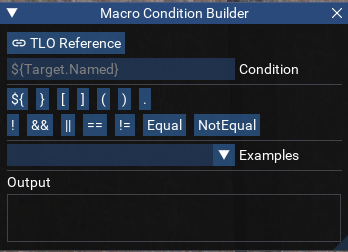
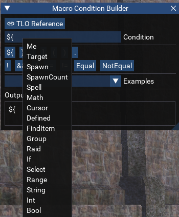
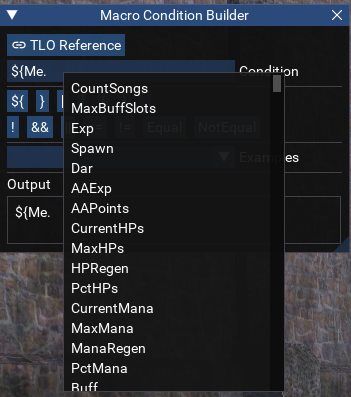

# Condition Builder

[View Repo](https://github.com/aquietone/condition-builder){target=_blank}  
[View on RedGuides](https://www.redguides.com/community/resources/macro-condition-builder.2652/){target=_blank}  
[Download](https://github.com/aquietone/condition-builder/archive/refs/heads/main.zip)  

## Overview

A utility to help generate valid macro if conditions for use in INI files such as KissAssist or MuleAssist conditions.

## Installation

Download the script and place it into the MQ `lua` folder.

## Usage

Run the script with `/lua run condbuilder`.

  