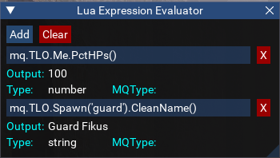
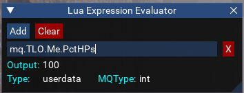

# Lua Expression Evaluator

[View Repo](https://github.com/aquietone/misclua){target=_blank}  
[View on RedGuides](https://www.redguides.com/community/resources/lua-expression-evaluator.2589/){target=_blank}  
[Download](https://raw.githubusercontent.com/aquietone/misclua/main/eval.lua)  

## Overview

A utility to test out lua expressions and view the resulting datatypes of the output, similar to the macro expression evaluator.

## Installation

Download the script and place it into the MQ `lua` folder.

## Usage

Run the script with `/lua run eval`.

 
 