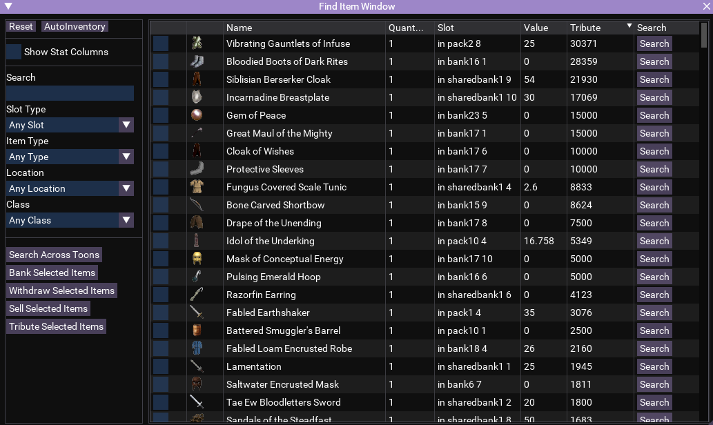

# Find Item Window

[View Repo](https://github.com/aquietone/finditemwindow){target=_blank}  
[Download](https://github.com/aquietone/finditemwindow/archive/refs/heads/main.zip)  

## Overview

This lua script recreates the find item window from live EQ for EMU servers where it does not exist.  

In addition, it has some very, very simple cross toon search capabilities using MQ2DanNet, which can be used to find and request items from other online toons. It doesn't have the most robust logic for requesting items, and will only attempt one time as long as they are in the same zone and within trading distance of the requesting character.  

  
  

## Installation

1. Clone the repo or download the zip file linked above.
2. Move `find.lua` into the MQ `lua` folder

## Commands

* Start the script with `/lua run find`.  
* Open the find window when the script is already running with `/findwindow`.  
