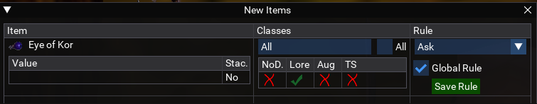
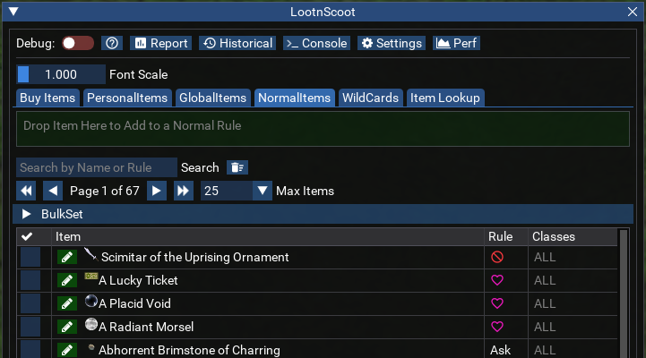
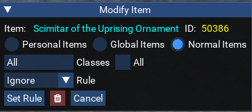
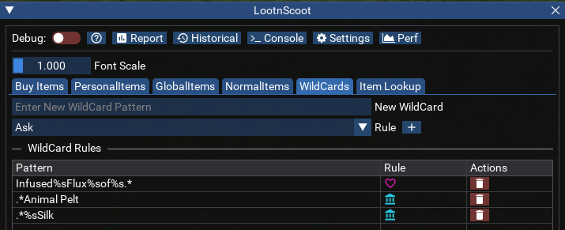
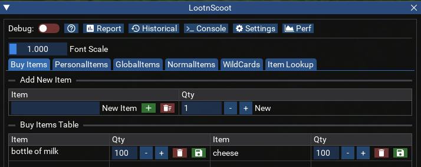

# Loot N Scoot

[View Repo](https://github.com/aquietone/lootnscoot){target=_blank}  
[Download](https://github.com/aquietone/lootnscoot/archive/refs/heads/main.zip)

## Overview

Loot N Scoot (LNS) is a port of NinjAdvLoot.inc for looting on EMU servers. It loots items
from corpses directly, since EMU does not support the advanced looting routines used on
live servers.  
LNS can run in standalone mode, alongside your automation scripts, or in
directed mode where it is controlled by another script (e.g. RGMercs) via MQ Actors. 

## Running the script

* `/lua run lootnscoot standalone` &nbsp;&nbsp;Start LNS alongside your automation.
* `/lua run lootnscoot directed <directorname>` &nbsp;&nbsp;Launch LNS in directed mode.
* `/lua run lootnscoot once` &nbsp;&nbsp;Perform one pass of looting corpses then exit.
* `/lua run lootnscoot sellstuff` &nbsp;&nbsp;Sell inventory items marked as Sell.
* `/lua run lootnscoot bankstuff` &nbsp;&nbsp;Bank items marked as Bank.
* `/lua run lootnscoot tributestuff` &nbsp;&nbsp;Tribute items marked as Tribute.
* `/lua run lootnscoot cleanup` &nbsp;&nbsp;Perform inventory cleanup.

## Loot rules

LNS evaluates loot rules in the following order:

1. **Personal Rules** – highest priority, per character.
2. **Global Rules** – shared between all looters, checked before normal rules.
3. **Normal Rules** – shared default rules.
4. **Wildcard Rules** – regular expressions matched if no direct rule exists.

When new items are looted the "new items" window appears (if `AutoShowNewItem` is enabled)
and rules may be assigned there:



Existing rules can be modified from one of the Personal Items, Global Items or Normal Items tabs:

 

### Supported Rule Types

* Ask
* CanUse
* Sell
* Keep
* Quest (optionally `Quest|#` for quantity)
* Bank
* Tribute
* Ignore
* Destroy

### Loot Rule Commands

Commands to add rules into the Normal Rules table:
```
/lns sell "[ITEM_NAME]"
/lns keep "[ITEM_NAME]"
/lns quest "[ITEM_NAME]"
/lns bank "[ITEM_NAME]"
/lns ignore "[ITEM_NAME]"
/lns destroy "[ITEM_NAME]"
```

`[ITEM_NAME]` is optional (defaults to cursor). Specific tables can be targeted with:

```
/lns <personalitem|globalitem|normalitem> <rule> "ITEM_NAME" [qty]
```

Legacy lootutils commands remain supported:

```
/lootutils sell "${Cursor.Name}"
/lootutils keep "${Cursor.Name}"
/lootutils bank "${Cursor.Name}"
/lootutils ignore "${Cursor.Name}"
```

### Wildcard Loot Rules

Wildcard rules let you define regex-based matches for multiple items.



Some general regex guidance:
* `.*` matches 0 or more characters.
* `.+` matches 1 or more characters.
* `%s` matches 1 whitespace character.
* `%.` matches 1 `.` period character.

Lua uses `%` symbol as an escape character.  
For more general regex help, see [regex101](https://regex101.com/).

## Other commands

```
/lns sellstuff         sell to targeted vendor
/lns bankstuff         bank inventory
/lns tributestuff      tribute flagged items
/lns restock           restock items defined in Buy Items
/lns cleanup           perform inventory cleanup
/lns loot              trigger a single loot cycle
/lns pause             pause LNS
/lns resume            resume LNS
/lns corpsereset       reset corpse history
/lns help              show help info
```

## Settings

All character settings, item data and loot rules are stored in an sqlite3 database under
`mq/resources/LootNScoot`. The table below shows the available options and their defaults, 
all of which can be configured via the UI or CLI.

| Setting | Default | Description |
|---------|---------|-------------|
| UseAutoRules | `true` | Let LNS decide loot rules on new items. |
| AutoShowNewItem | `false` | Automatically show new items in the looted window. |
| AlwaysAsk | `false` | Treat all items as Ask regardless of their rule. |
| AlwaysGlobal | `false` | Always assign new rules to global as well as normal rules. |
| CombatLooting | `false` | Enables looting during combat. Not recommended on the MT. |
| CorpseRadius | `100` | Radius to actively loot corpses (from you). |
| MobsTooClose | `40` | Don’t loot if mobs are in this range. |
| SaveBagSlots | `3` | Number of bag slots to keep empty; stop looting when reached. |
| TributeKeep | `false` | Keep items flagged Tribute. |
| MinTributeValue | `100` | Minimum Tribute points to keep item if TributeKeep is enabled. |
| MinSellPrice | `-1` | Minimum sell price to keep item (`-1` = any). |
| StackPlatValue | `0` | Minimum sell value for full stack. |
| StackableOnly | `false` | Only loot stackable items. |
| BankTradeskills | `false` | Flag tradeskill items as Bank. |
| DoLoot | `true` | Enable auto-looting in standalone mode. |
| LootForage | `true` | Enable looting of foraged items. |
| LootNoDrop | `false` | Loot NoDrop items. |
| LootNoDropNew | `false` | Loot new NoDrop items. |
| LootQuest | `true` | Loot items marked Quest (`LootNoDrop` required for NoDrop quest items). |
| DoDestroy | `false` | Enable Destroy functionality; otherwise Ignore acts as Destroy. |
| AlwaysDestroy | `false` | Always destroy non‑quest items marked Ignore when cleaning (requires DoDestroy). |
| QuestKeep | `10` | Default number to keep if item not set using `Quest|#`. |
| LootChannel | `"dgt"` | Channel to report loot to. |
| GroupChannel | `"dgze"` | Channel for group commands (default dgze). |
| ReportLoot | `true` | Report loot items to group. |
| ReportSkippedItems | `false` | Report skipped items to group. |
| SpamLootInfo | `false` | Echo spam for looting. |
| LootForageSpam | `false` | Echo spam for foraged items. |
| AddNewSales | `true` | Add Sell flag when manually sold during runtime. |
| AddNewTributes | `true` | Add Tribute flag when manually tributed during runtime. |
| MasterLooting | `false` | Master looter mode; prompts for who to loot for sell/keep/tribute. |
| LootCheckDelay | `0` | Seconds between loot checks. |
| HideNames | `false` | Hide names and use class shortname in looted window. |
| RecordData | `true` | Enable recording data for reports. |
| AutoTag | `false` | Automatically tag items to sell if they meet `MinSellPrice`. |
| AutoRestock | `true` | Automatically restock items from BuyItems when selling. |
| LootMyCorpse | `false` | Loot your own corpse if nearby (does not check for rez). |
| LootAugments | `false` | Loot augments. |
| CheckCorpseOnce | `true` | Check each corpse once and ignore it thereafter. |
| KeepSpells | `true` | Keep spells. |
| CanWear | `false` | Only loot items you can wear. |
| MaxCorpsesPerCycle | `5` | Maximum corpses to loot per cycle. |
| IgnoreBagSlot | `0` | Ignore this bag slot when buying/selling/tributes/destroy. |
| IgnoreMyNearCorpses | `false` | Ignore your own nearby corpses when looting. |
| TrackHistory | `true` | Enable inserting loot results into history table. |
| AlwaysEval | `false` | Re-evaluate non‑quest items (defunct). |
| GlobalLootOn | `true` | Toggle use of global rules (mostly unused). |

## Item Restocking
LNS can purchase items from vendors based on what is defined in the Buy Items tab. This can be useful for restocking food/drink or other reagents.



## Integrating with automation

In directed mode (`/lua run lootnscoot directed <script>`), LNS communicates using MQ Actors.
It sends messages to the director using mailbox `mailbox = "loot_module", script = "<script>"` and responds to
commands like:

* `directions = "doloot", who="<looter name>", server="<server name>"` – start looting.
* `directions = "setsettings_directed"` – apply settings.
* `directions = "getsettings_directed"` – request current settings.

Notifications sent by LNS include `Subject = "done_looting"`, `"processing"`,
and `"done_processing"`.

## Events

LNS listens for several events to manage its state:

* `eventCantLoot` – avoid corpses that others are looting.
* `eventSell` – mark items Sell when sold manually.
* `eventInventoryFull` – stop looting when inventory is full.
* `eventNovalue` – handle vendors who won't buy an item.
