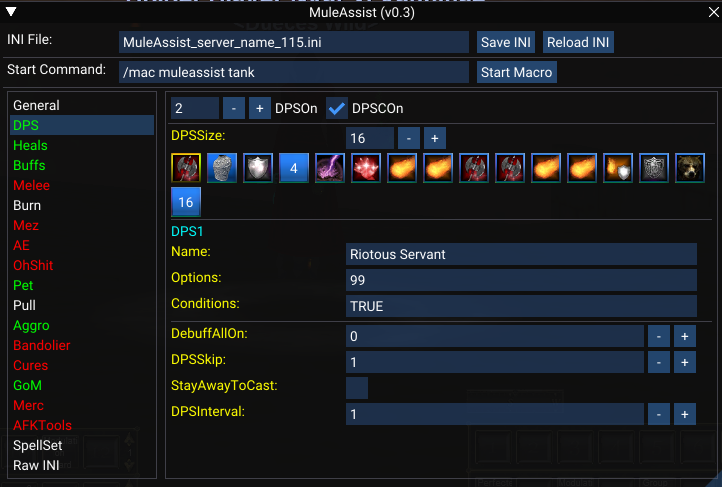
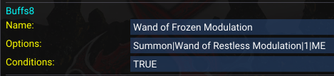
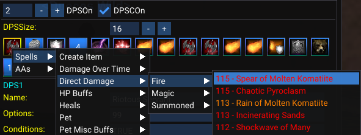

# MAUI

[View Repo](https://github.com/aquietone/maui){target=_blank}  
[View on RedGuides](https://www.redguides.com/community/resources/maui-muleassist-ui.2207/){target=_blank}  
[Download](https://github.com/aquietone/maui/-/archive/main/maui-main.zip)  

An INI Editor for the MuleAssist macro.



## Overview

MAUI is a replacement for the `MQ2Mule` plugin so that `MuleAssist` users can continue to have a UI to make INI updates.  
It doesn't do everything which the old plugin did, but it should look pretty familiar.  

## Installation

### Manual Install

1. Clone the repo or download the zip file linked above.
2. Move the `maui` folder into the MQ `lua` folder.
3. Start the script with `/lua run maui` and accept the prompt to install `lfs.dll`.  

### RedGuides Launcher

1. Navigate to the MAUI resource page and click the `Watch` button on the `Overview` tab.  
2. Open the RedGuides Launcher and install MAUI from the `Lua` tab.  
3. Start the script with `/lua run maui` and accept the prompt to install `lfs.dll`.  

The resulting folder content should look like this:  

```
lua/
├── maui/
│   ├── addons/
│   │   └── ma.lua
│   ├── lib/
│   │   └── Cache.lua
│   │   └── ImGuiFileDialog.lua
│   │   └── LIP.lua
│   ├── schemas/
│   │   └── ma.lua
│   ├── globals.lua
│   ├── init.lua
│   └── utils.lua
```

`lfs.dll` is lua file system from the [MQ LuaRocks Server](https://macroquest.gitlab.io/next/luarockserver/){target=_blank}  

## Commands

* `/lua run maui` -- Start the script
* `/lua stop maui` -- End the script  
* `/maui stop` -- Stop MAUI  
* `/maui` -- MAUI Help  
* `/maui hide` -- Hide MAUI  
* `/maui show` -- Show MAUI  
* `/mqoverlay resume` -- Recover ImGui windows incase of an error  

## Editing List Entries

List entries in the MA INI file, like `DPS1` or `Heals1`, are made up of multiple parts, as well as an associated condition, like `DPSCond1. For example:

```ini
Buffs1=Wand of Frozen Modulation|Summon|Wand of Restless Modulation|1|ME
BuffsCond1=TRUE
```

MAUI breaks this line up into 3 pieces of information:

  

* `Name` -- Everything up to the first pipe (`|`), which is typically the spell or item name.In the example above, `Wand of Frozen Modulation`.  
* `Options` -- Everything which comes after the first pipe (`|`). In the example above, `Summon|Wand of Restless Modulation|1|ME`.  
* `Conditions` -- The entire condition entry. In the example above, `TRUE`.  

In addition to typing in a value for the name, you can right click the icon in the list and navigate spells, discs and AAs from the context menu.
Right clicking an icon in something like DPS or Buffs list will give a menu of available spells, AAs, discs to choose from:  

  

## Upgrading Spells

When viewing the details of a list entry, an upgrade button will be displayed if it is determined that you have a stronger version of the spell memorized. The logic for detecting stronger spells is far from perfect, so it might be wrong a lot of the time.  

  

Similarly, downgrades will be suggested. This is in case you imported an INI which is above your level, and includes spells which you don't have memorized yet.  

## Raw INI Editor

The INI file can still be edited directly through the `Raw INI` tab.

  

## Importing KissAssist INI Files

MAUI can import KA INI files and convert them to MA INI files. This has only been tested with a limited number of KA12 INI files, so YMMV. It works like so:  

1. Place the KA INI you wish to import into your MQ `config` folder.  
2. On the `Import KA INI` section, enter the file name (no file explorer, it must be typed manually/pasted in)  
3. Click `Import`  

All keys which are common to both KA and MA will be copied over to the resulting MA INI. Any keys which are KA or MA specific will not be set.
Any lines which include a condition, like `DPS1=burst of flame|cond1` will be converted to what MA expects, with the content of `cond1` from `KConditions` being set into `DPSCond1`.
