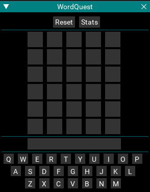

# WordQuest

[View Repo](https://gitlab.com/aquietone/wordquest){target=_blank}  
[View on RedGuides](https://www.redguides.com/community/resources/wordquest.2455/){target=_blank}  
[Download](https://gitlab.com/aquietone/wordquest/-/archive/main/wordquest-main.zip)  

## Overview

Play a game in your game while your game plays itself.

## Installation

### Manual Install

1. Clone the repo or download the zip file linked above.
2. Move `wordquest.lua`, `wordquestvalid.txt` and `wordquestwords.lua` into the MQ `lua` folder

### RedGuides Launcher

1. Navigate to the WordQuest resource page and click the `Watch` button on the `Overview` tab.  
2. Open the RedGuides Launcher and install WordQuest from the `Lua` tab. 

## Commands

- `/lua run wordquest` -- Start the script  

## Rules

- Try to guess the word. You get 6 tries.  
- Yellow letters are letters which exist in the word, but not in that position.  
- Green letters are letters which exist in the word and are in the correct position.  
- Red letters are letters which have been used and are not a part of the word.  